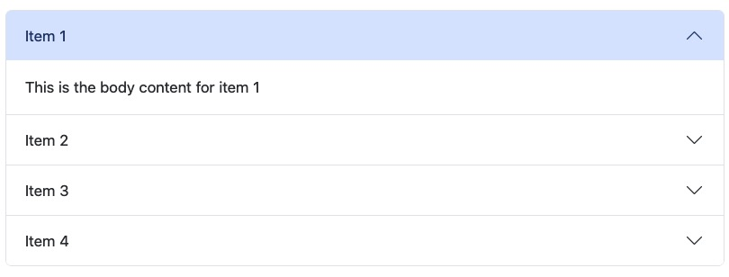

# accordion

A quarto shortcode extension to add [Bootstrap accordion component](https://getbootstrap.com/docs/5.1/components/accordion/) for html format.



## Install

- Requires Quarto >= 1.4.0
- In the root of the quarto project, run in terminal:

```
quarto add royfrancis/quarto-accordion
```

This will install the extension under the `_extensions` subdirectory.

## Usage

```
---
title: Accordion
accordion:
  - accordion-1:
    - header: Click here to view contents
      body: This is the body content
filters:
  - accordion
---


```

For more examples and usage guide, see [here](https://royfrancis.github.io/quarto-accordion).

---

2024 • Roy Francis
