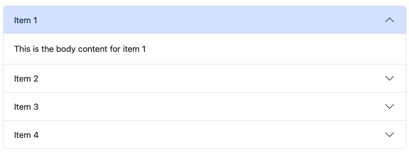

# accordion 

A quarto shortcode extension to add [Bootstrap accordion component](https://getbootstrap.com/docs/5.1/components/accordion/) for **html** and **revealjs** formats. Minimal non-interactive fallbacks are provided for other output formats **pdf** and **typst**.



## Latest updates

- v1.1.0
- Accordion content can now be defined inline in the shortcode arguments. This is in addition to the existing approach of defining content in the YAML metadata.
- Markdown and HTML formatting is supported in accordion content
- Support for additional output formats such as pdf, typst and revealjs
- Plain content fallback for unsupported formats
- More documentation and testing

## Install

- Requires Quarto >= 1.4.0
- In the root of the quarto project, run in terminal:

```
quarto add royfrancis/quarto-accordion
```

This will install the extension under the `_extensions` subdirectory.

## Usage

Examples showing how to define accordion items using YAML metadata and inline shortcode arguments. Mandatory parameters are `header` and `body`. Optional parameters are `collapsed` (defaults to true) and `id` (defaults to auto-generated).

### YAML metadata

```
---
title: Accordion
accordion:
  - accordion-1:
    - header: Click here to view contents
      body: This is the body content
      collapsed: true
      id: custom-item-1
filters:
  - accordion
---


```

### Inline content

```

```

```
{{< accordion label="accordion-3" items='[{"header":"Item 1","body":"This is the body content for item 1.","collapsed":true},{"header":"Item 2","body":"This is the body content for item 2.","collapsed":true}]' >}}
```

For more examples and usage guide, see [here](https://royfrancis.github.io/quarto-accordion).

---

2026 • Roy Francis
